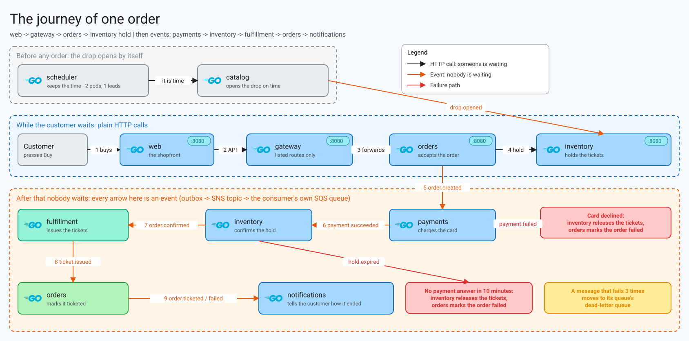

# TicketDrop - Event-Driven Ticketing Platform

A DevOps project that runs 9 Go services as a ticket-drop platform, built with Docker, PostgreSQL, SNS and SQS, and designed to be deployed to AWS EKS.

---

## Project Objective

The objective of the project was to build a platform that stays correct under the worst conditions a ticket sale can produce: far more buyers than tickets, all arriving at once, while services crash and restart. I prioritised correctness and recoverability over everything else, so the architectural decisions reflect this. The platform must never oversell, never lose an order, never charge a customer twice, and never leave an order stuck.

## About the app

This is a ticketing app written in Go, where an organiser announces a drop (an event with a venue, an opening time, and tiers with prices and capacities) and customers buy tickets through a web shopfront once it opens. When a customer places an order, the application holds the tickets, takes the payment, issues the tickets and notifies the customer, all in the background. The customer can watch the order move from `pending` to its final state, which is either `ticketed` or `failed` with a reason.

The nine services are:

| Service | Role |
|---|---|
| web | Server-rendered shopfront (Go templates + htmx) |
| gateway | Public API reverse proxy with an explicit route allowlist |
| catalog | Owns drops, tiers, prices and capacities; announces when a drop opens |
| orders | Accepts orders and tracks each one to `ticketed` or `failed` |
| inventory | Owns stock; holds, confirms and releases tickets |
| payments | Charges the customer through a simulated payment provider |
| fulfillment | Issues the tickets |
| notifications | Tells the customer how the order ended |
| scheduler | A clock that opens drops on time and expires unpaid holds |

---

## Architecture Diagram



---

## Documentation

The project is documented as the decisions behind it, not just the tools in it. Start with the case study; [docs/README.md](docs/README.md) has the full index.

| Document | What it answers |
|---|---|
| [Case study](docs/CASE_STUDY.md) | What the problem was, why I chose this approach, what broke, what I changed, and what is still open |
| [Decisions](docs/DECISIONS.md) | Every choice, why it was made, and what it costs |
| [Troubleshooting](docs/TROUBLESHOOTING.md) | Failures that actually happened, their cause and their fix |
| [Proof](docs/PROOF.md) | Each promise the system makes, how it was broken on purpose, and the results of real runs |
| [Scaling](docs/SCALING.md) | What I would do differently for a much smaller or much larger crowd |
| [Interview notes](docs/INTERVIEW.md) | The project told in 30 seconds, in two minutes, and as short stories with evidence |

---

## Technologies Used:

- Go
- Docker and Docker Compose
- PostgreSQL
- AWS SNS and SQS (emulated locally with goaws)
- Prometheus metrics
- htmx
- Make and Bash

---

## Project Structure:

```text
.
|-- CLAUDE.md
|-- Makefile
|-- README.md
|-- go.mod
|-- go.sum
|-- deploy
|   `-- local
|       |-- compose.yaml
|       |-- goaws.yaml
|       `-- postgres-init.sql
|-- docs
|   |-- README.md
|   |-- CASE_STUDY.md
|   |-- DECISIONS.md
|   |-- TROUBLESHOOTING.md
|   |-- PROOF.md
|   |-- SCALING.md
|   |-- INTERVIEW.md
|   |-- diagrams
|   `-- guide
|-- pkg
|   |-- contracts
|   |   `-- contracts.go
|   `-- platform
|       |-- config
|       |-- correlation
|       |-- db
|       |-- events
|       |-- httpx
|       |-- logging
|       `-- service
|-- scripts
|   |-- drop-check.sh
|   |-- lib.sh
|   `-- outage-check.sh
`-- services
    |-- catalog
    |   |-- Dockerfile
    |   |-- cmd
    |   |-- internal
    |   `-- migrations
    |-- fulfillment
    |   |-- Dockerfile
    |   |-- cmd
    |   |-- internal
    |   `-- migrations
    |-- gateway
    |   |-- Dockerfile
    |   |-- cmd
    |   `-- internal
    |-- inventory
    |   |-- Dockerfile
    |   |-- cmd
    |   |-- internal
    |   `-- migrations
    |-- notifications
    |   |-- Dockerfile
    |   |-- cmd
    |   `-- internal
    |-- orders
    |   |-- Dockerfile
    |   |-- cmd
    |   |-- internal
    |   `-- migrations
    |-- payments
    |   |-- Dockerfile
    |   |-- cmd
    |   |-- internal
    |   `-- migrations
    |-- scheduler
    |   |-- Dockerfile
    |   |-- cmd
    |   `-- internal
    `-- web
        |-- Dockerfile
        |-- cmd
        `-- internal
```

---

## Running it locally

Requires Go, Docker with Compose, and for the two checks `curl`, `jq` and the `aws` CLI.

```bash
make up            # build and start the stack; shopfront on http://localhost:8092
make test          # unit tests
make vet           # go vet and a gofmt check
make drop-check    # sell out a drop while killing a service, then prove nothing was oversold or lost
make outage-check  # take the payment provider down, then prove no order or ticket is left stuck
make down          # stop the stack and delete its data
```

---

# Architectural decisions

The full list, with the reason and the cost of each choice, is in [docs/DECISIONS.md](docs/DECISIONS.md).

## Microservices with a Database per Service
I decided to separate the application into nine services and give each one its own PostgreSQL database. No service can read or write another service's tables, so each can be changed, deployed and scaled independently, and a slow or failed service cannot lock another's data. The cost is that there are no cross-service transactions: every workflow that spans services has to be built from events and has to tolerate being interrupted halfway.

## Event Fan-out through SNS and SQS
Services talk through events rather than calling each other. Every event goes to one SNS topic, and each consumer has its own SQS queue that is filtered to the event types it cares about. This means a new consumer can be added without touching the publisher, a consumer that is down simply finds its messages waiting when it comes back, and a backlog in one service does not slow down the others. The only synchronous calls are the ticket hold from orders to inventory and the scheduler's timer calls.

## Transactional Outbox and Idempotent Consumers
A service cannot atomically write to its database and publish to SNS, so a crash between the two would either lose an event or publish one for a change that never happened. I solved this by writing each event to an outbox table in the same transaction as the change, and having a relay publish from that table. This gives at-least-once delivery, so events can arrive twice. Each consumer therefore records the IDs of the events it has handled in the same transaction as its work, and a redelivered event changes nothing. A message that cannot be handled after three attempts goes to a dead-letter queue for a person to look at.

## Preventing Overselling with One Conditional UPDATE
Stock is one counter per tier, and a hold is a single `UPDATE ... WHERE available >= n`. The database decides in one statement whether the tickets exist, so two buyers can never both take the last ticket. I chose this over reading the stock and then writing it, which has a race between the two steps, and over a queue of buyers, which adds a component to operate. An order is only accepted after inventory has held its tickets, so a sold-out drop is refused immediately rather than failing later.

## Holds That Expire
A hold has an expiry, and unpaid holds are released back to stock after a grace period. This means a payment provider outage cannot leave tickets locked forever. Payments never charges an order whose hold has already expired. A declined payment is treated as an outcome and fails the order, whereas a provider error is retried and then dead-lettered, because one is the customer's answer and the other is our problem.

## A Scheduler That Only Keeps Time
The scheduler does no work itself. It calls catalog every second to open drops that are due and inventory every five seconds to expire holds, and those services do the work. It runs as two replicas and the one holding a PostgreSQL advisory lock leads, so if the leader dies the standby takes over. Everything it calls is safe to call twice at once, so a brief overlap between leaders does no harm.

## Graceful Shutdown in a Fixed Order
Every service shuts down in the same order: readiness goes false, it waits for traffic to drain, finishes in-flight HTTP requests, stops its consumer, and stops the outbox relay last so that the events written by the final handlers still get published. This is what allows a service to be restarted or killed during a sale without losing an order.

## Proving It Rather Than Assuming It
Two scripts test the claims above against the real running stack. `make drop-check` places more orders than there are tickets, SIGKILLs a service mid-run, and then asserts that nothing was oversold, every order reached a final state, stock adds up and each customer was notified once. `make outage-check` takes the payment provider down, kills the scheduler's leader, and asserts that the standby took over, the unpaid orders failed, the tickets returned to stock and nobody was charged afterwards.

---

# Demo

<!-- TODO: add demo link -->

---

# Images

<!-- TODO: add screenshots -->

## App Images

## Monitoring Images

## Pipeline

---

## Future Improvements

### Deployment to AWS EKS
The application currently runs locally on Docker Compose. The next step is to deploy it to AWS EKS, with the infrastructure defined in Terraform, the workloads packaged with Helm, and a GitHub Actions pipeline to build, scan and deploy the images. The SNS topic, SQS queues, subscriptions and redrive policies that goaws emulates locally would be created by Terraform.

### Event-Driven Autoscaling
Fulfillment is deliberately throttled so that a backlog builds up during a sale. A future improvement is to scale the consumers on the number of messages waiting in their SQS queue rather than on CPU, since queue depth is what actually represents demand during a drop.

### Automatic Refunds
A payment that succeeds after its hold has already been released currently goes to the dead-letter queue for a person to refund. This could be handled automatically with a refund event.

### Real Notifications
Notifications currently writes a log line. A real email or SMS sender would go behind the existing `Sender` interface, along with a record of what has been sent so a redelivered event does not message the customer twice.

## Security Measures Implemented

- Distroless container images: Every service runs in an image with no shell and no package manager, which reduces what an attacker can do inside a compromised container.

- Non-root containers: Every service runs as an unprivileged user (UID 65532) rather than root.

- Gateway route allowlist: The gateway forwards only the routes that are explicitly listed, so a new endpoint on a service is not public until it is deliberately added.

- Internal routes kept private: Routes under `/internal/` exist only for service-to-service calls and are never exposed through the gateway.

- Shopfront uses only the public API: The web service has no private route into any service, so it can do nothing a member of the public could not.

- Separate admin port: Health checks and Prometheus metrics are served on a different port from the application, so they are not exposed alongside the public API.

- Database per service: Each service is configured with only its own database and never queries another service's tables. Locally the databases share one server and one login; separate credentials per service come with the AWS deployment.

- Environment-only configuration: No settings or credentials are hardcoded in the application, and `.env` files, Terraform state and variable files are excluded from the repository.

- Bounded service calls: Calls between services have a timeout, so a slow dependency cannot exhaust another service's resources.

- Pinned image versions: Base images and dependencies are pinned to specific versions rather than `latest`.
